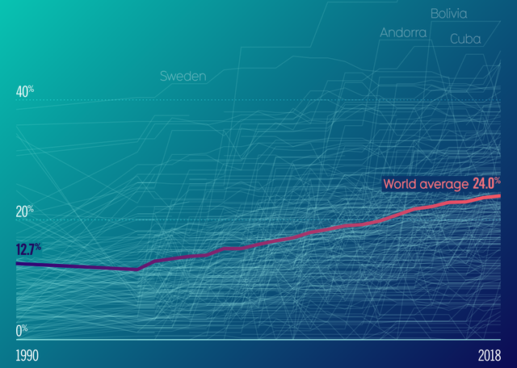
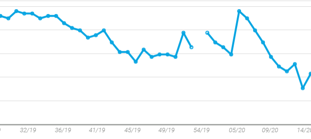

# Project 2: Visualize Music Trends
UT-TOR-DATA-PT-01-2020-U-C Group Project 2

## Chosen Topic and Rationale

Top 100 music charts. With the available data provided by the acharts page (scraped) we will be creating an interactive dashboard that will allow you to see patterns beyond the weekly music trends. 

Length of time song is on the chart in relation to genre, artist age, country. Overall most popular genres, average artist age.

## Link to datasets

* Candian top singles: [Data from 2007 to current week (updated weekly)](https://acharts.co/canada_singles_top_100#archive)

* Artist information: Genre, age, photo etc. Wikipedia Splinter query. Example: [Billie Eilish](https://en.wikipedia.org/wiki/Billie_Eilish)

* Saving data to SQLite Database

## Inspiration visualization

1. Line graph showing song growth: superposition of all song life-lines from first entry to the chart until last exit (there might be reentries). (rank vs weeks)

| Superposition | Single |
| ------------- | ------ |
|  |  |

2. Genre information: each bubble is a genre and bubbles inside are artists/songs (size will represent popularity)- zoomable sunburst & zoomable circle packing -- plotly

| Sunburst | Bubbles |
| -------- | ------- |
|  |  |

3. Timeline of artist-- singles that made the chart (each bar is single- height of bar is how long it was popular)

4. Word cloud: get a numerical metric to measure an artist’s success and create a word cloud of popular music

5. Bar chart for genre/gender(male, female, band) (stacked to group bar chart)

## A sketch of the final design

*To do...*
