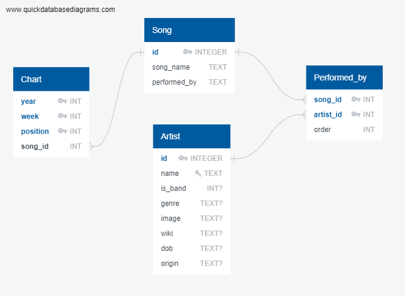

# Database model
UT-TOR-DATA-PT-01-2020-U-C Group Project 2

Link to schema: https://app.quickdatabasediagrams.com/#/d/5e2XSw



## Table semantics and datatypes are in the DDL code:

```sql
-- Exported from QuickDBD: https://www.quickdatabasediagrams.com/
-- Link to schema: https://app.quickdatabasediagrams.com/#/d/5e2XSw
-- NOTE! If you have used non-SQL datatypes in your design, you will have to change these here.

-- UT-TOR-DATA-PT-01-2020-U-C Group Project 2
-- ---------------------------------
-- Notes:
-- 1. By default SQLite doesn't enfoce foreign key constraints.
--    Use "PRAGMA foreign_keys=on;" to overcome this
-- 2. Object are created in the order to satisfy foreign key constraints
-- 3. "Chart" table used a computed column, however this feature is new in SQLite (first appeard in v3.31 in Jan 2020)
--    and 3rd party software like SQLiteStudio or DB Browser for SQLite doesn't support it yet, so I decided to remove
--    this column from the table :( Same functionality can be implemented in a view or in SQL query

-- Table maps (song name, performer) pair to an id
-- Every song is uniquely identified by name and performer (which might be several bands/musicians)
CREATE TABLE "Song" (
    -- id - synthetic key used for referencing
    "id" INTEGER PRIMARY KEY,
    -- First part of the UNIQUE constraint
    "song_name" TEXT NOT NULL ,
    -- Second part of the UNIQUE constraint
    -- It is a string as visible on the web page.
    -- However, for collaborations it actually consistes of several parts - each for one performer, which is visible during scraping.
    -- Later each performer is saved separately and its order in the list is saved too.
    "performed_by" TEXT NOT NULL,
    CONSTRAINT "uniq_Song" UNIQUE (
        "song_name", "performed_by"
    )
)

GO

CREATE UNIQUE INDEX "idx_Song" on "Song" ( "song_name", "performed_by" )

GO

-- Table represents a chart: 100 songs for a week in a year
-- Create using 'WITHOUT ROWID' because of the composite PK
-- Index by song_id
CREATE TABLE "Chart" (
    "year" INT,
    "week" INT,
    "position" INT,
    "song_id" INT,
    -- Computed column. Probably should be indexed.
    -- N.B. Requires SQLite version 3.31.0 (2020-01-22) - new feature!
    -- "score" INT GENERATED ALWAYS AS (101-"position") VIRTUAL,
    PRIMARY KEY ("year", "week", "position"),
    FOREIGN KEY ("song_id") REFERENCES "Song"("id")
) WITHOUT ROWID

GO

CREATE INDEX "idx_Chart_Song_Id" on "Chart" ( "song_id" )

GO

-- Table keeps information about all artists encountered in the charts
-- A musician or a band. Name is derived from charts website. Other info should be scraped from Wikipedia.
-- Probably will have to make special admin page to help fill some info by hand
CREATE TABLE "Artist" (
    "id" INTEGER PRIMARY KEY,
    "name" TEXT NOT NULL UNIQUE,
    "is_band" INT NULL,
    "genre" TEXT NULL,
    "image" TEXT NULL,
    "wiki" TEXT NULL,
    "dob" TEXT NULL,
    "origin" TEXT NULL
)

GO

CREATE UNIQUE INDEX "idx_Artist_Name" on "Artist" ("name")

GO

CREATE INDEX "idx_Artist_Genre" on "Artist" ( "genre" )

GO

-- Table keeps a ranked list of artists that performed a song
-- The table is necessary because many songs are created in collaboraton by several artists.
-- Those performers are listed on the web page which is seen during scraping.
-- The ordinal number of an artist in this list is saved in "order" column. The value starts with 0.
-- Example of multiartist strings: "Dan featuring Shay and Justin Bieber"
-- Create using 'WITHOUT ROWID' because of the composite PK
CREATE TABLE "Performed_by" (
    "song_id" INT NOT NULL ,
    "artist_id" INT NOT NULL ,
    -- Ordinal number of the performer in Song.performed_by string
    "order" INT NOT NULL ,
    PRIMARY KEY ("song_id", "artist_id"),
    FOREIGN KEY ("song_id") REFERENCES "Song"("id"),
    FOREIGN KEY ("artist_id") REFERENCES "Artist"("id")
) WITHOUT ROWID

GO
```

## Order of operations when adding new chart line:

1. Add song name and performer to the Song table, obtain song_id
2. Split performer into a list of 1 or more artists (for collaborations), save them in Artist table, obtain a list of corresponding artist_ids
3. Add artist_ids into the Performed_by table for this song_id specifying their order of appearance
4. Add song_id to the chart for the corresponding (year, week, position)
